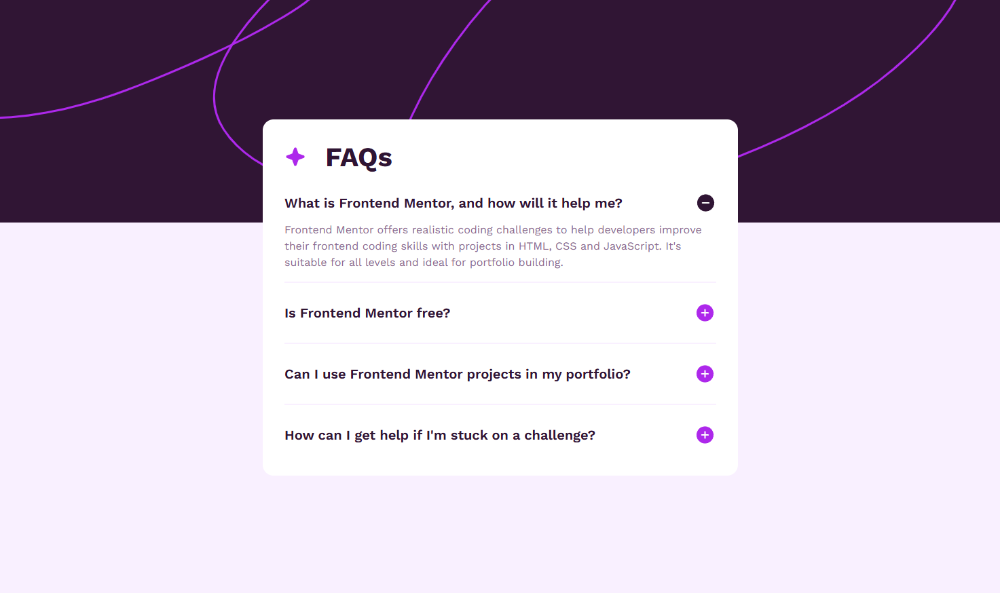

# 🌐 Frontend Mentor - FAQ accordion solution

This is my solution for the [FAQ accordion challenge on Frontend Mentor](https://www.frontendmentor.io/challenges/faq-accordion-wyfFdeBwBz). Frontend Mentor challenges help you improve your coding skills by building realistic projects.

---

## 📋 Table of contents

- [🌍 Overview](#-overview)
  - [✨ The challenge](#-the-challenge)
  - [🖼️ Screenshot](#-screenshot)
  - [🔗 Links](#-links)
- [🛠️ My process](#-my-process)
  - [🧰 Built with](#-built-with)
  - [🧠 What I learned](#-what-i-learned)
- [🚀 Continued development](#-continued-development)
- [📖 Useful resources](#-useful-resources)
- [👨‍💻 Author](#-author)
- [💖 Acknowledgments](#-acknowledgments)

---

## 🌍 Overview

### ✨ Features

A FAQ accordion with:

- Responsive layout optimized for mobile and desktop
- Semantic accordion built with `<details>` and `<summary>`
- Smooth open/close animations using modern CSS
- Hover and focus states for improved accessibility
- Respects prefers-reduced-motion for better user experience

---

### 🖼️ Preview



---

### 🔗 Links 

- 💡 Solution URL: [Frontend Mentor Solution](https://www.frontendmentor.io/solutions/faq-accordion-with-html-css-and-javascript-IHdB1wTfoE)
- 🌐 Live Site URL: [Live Demo](https://thewizard04-faq-accordion.vercel.app) 

---

## 🛠️ My process

### 🧰 Built with

| Category  | Tools                     |
| --------- | ------------------------- |
| Structure | **Semantic HTML5 markup** |
| Styles    | **CSS (Flexbox & Grid)**  |

### 🧠 What I learned

While building this project, I focused on writing clean, semantic, and accessible markup without relying on JavaScript.

Some key takeaways:

- Leveraging native `<details>` and `<summary>` elements for built-in accessibility and keyboard navigation
- Managing interactive states using attribute selectors like `[open]`
- Creating custom toggle icons using CSS pseudo-elements
- Improving layout structure using Flexbox and CSS variables
- Enhancing accessibility with `:focus-visible` and `prefers-reduced-motion`

Here’s an example of how I handled the toggle icon state:

```css
.accordion-summary::after {
  content: "";
  position: absolute;
  right: 0;
  top: 50%;
  width: 24px;
  height: 24px;
  background-image: url("images/icon-plus.svg");
  background-repeat: no-repeat;
  background-size: contain;
  transform: translateY(-50%);
  transition: transform 0.5s ease;
}

.accordion-details[open] .accordion-summary::after {
  transform: translateY(-50%) rotate(45deg);
}
```

---

## 🚀 Continued development

In future projects, I want to focus more on:

- Writing more modular and scalable CSS architecture
- Improving cross-browser safety when using modern CSS features
- Exploring subtle UI animations while maintaining accessibility
- Converting static components into reusable JavaScript or React components

---

## 📖 Useful resources

- [MDN Web Docs](https://developer.mozilla.org) – My primary reference for HTML semantics and modern CSS features.
- [Frontend Mentor Community](https://www.frontendmentor.io/community) – Helpful discussions and solution comparisons.

---

## 👨‍💻 Author

- GitHub - https://github.com/CrazyWizard04
- Frontend Mentor - https://www.frontendmentor.io/profile/crazywizard04

---

## 💖 Acknowledgments

A big thanks to **Frontend Mentor** for providing structured, real-world challenges that help sharpen frontend development skills.
Their projects are a fantastic way to practice real-world frontend development skills and continuously improve as a developer.

Thank you <3
